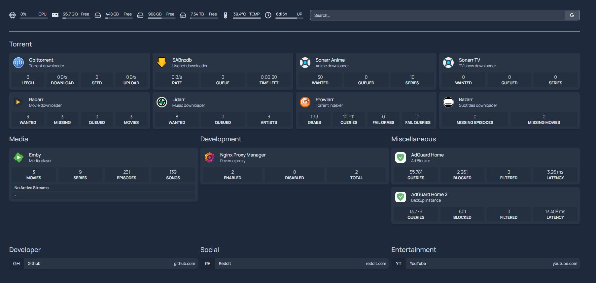

# Complete Media Server Stack

I recently started my Homelab journey and I wanted to share some of the services I run for those interested in doing something similar. This stack is focused on everything you need to run a local media server and even share your library with your friends.

### Hardware tested
- ACEMAGICIAN AM06PRO Mini PC, AMD Ryzen 7 5700U with Ubuntu Server 24.04
- Raspberry Pi 5 8GB with Raspberry Pi OS Lite (64-bit)

### Some of the features:
- Separate **Sonarr** instances, one for ```TV shows``` and one for ```Anime```, each with their own Custom Formats and Quality profiles. Why separate instances? It's easier to maintain and keep the relevant custom formats isolated. 1080p quality is usually enough for most anime but that's not the case for TV shows.
- **Radarr** with Custom Formats and Quality Profiles.
- Default **Lidarr** because I haven't found an optimal configuration yet.
- **Prowlarr** with **Flaresolver** to solve Cloudflare DNS challenges that some indexers may encounter.
- **Bazarr** for everything related to subtitles.
- **Requestrr** to integrate your stack with Discord. You and your friends can request anime/movies/tv shows right in a text channel with DM notifications when downloads are finished.
- **Qbittorrent** with VPN integration (Wireguard) right out of the box.
- **Sabnzbd** for those wanting to integrate the ```Usenet``` protocol in their stack. Also with VPN integration (Wireguard).
- **Emby** as our media server of choice. Feel free to replace it with your favorite one.
- **Homepage** dashboard to visualize all your services in one place.
- **Nginx Proxy Manager** in conjunction with a custom domain hosted in **Cloudflare** and **Let's Encrypt SSL** certificates to share your Emby library with your friends. Your service could be something like: ```https://emby.example.com```.
- Custom python scripts for things like creating the optimal folder structure needed for your apps, scripts to import ```Trash Guides``` custom formats and quality profiles (these are quite painful to do 1 by 1).
- Extra: this isn't related to media but 

Stay tuned for updates.

## Homepage

Your final homepage dashboard will look something like this.


